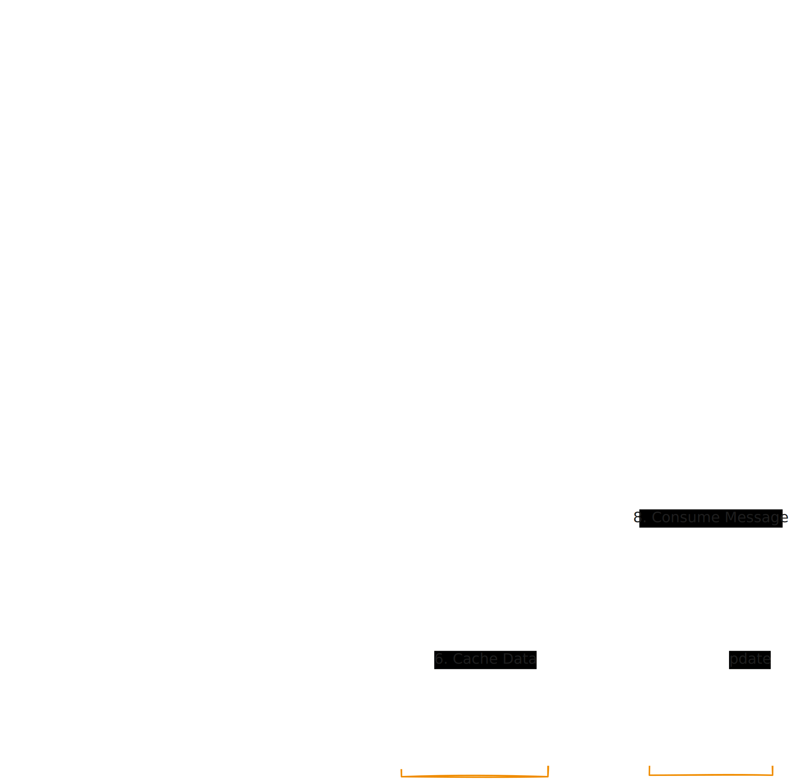
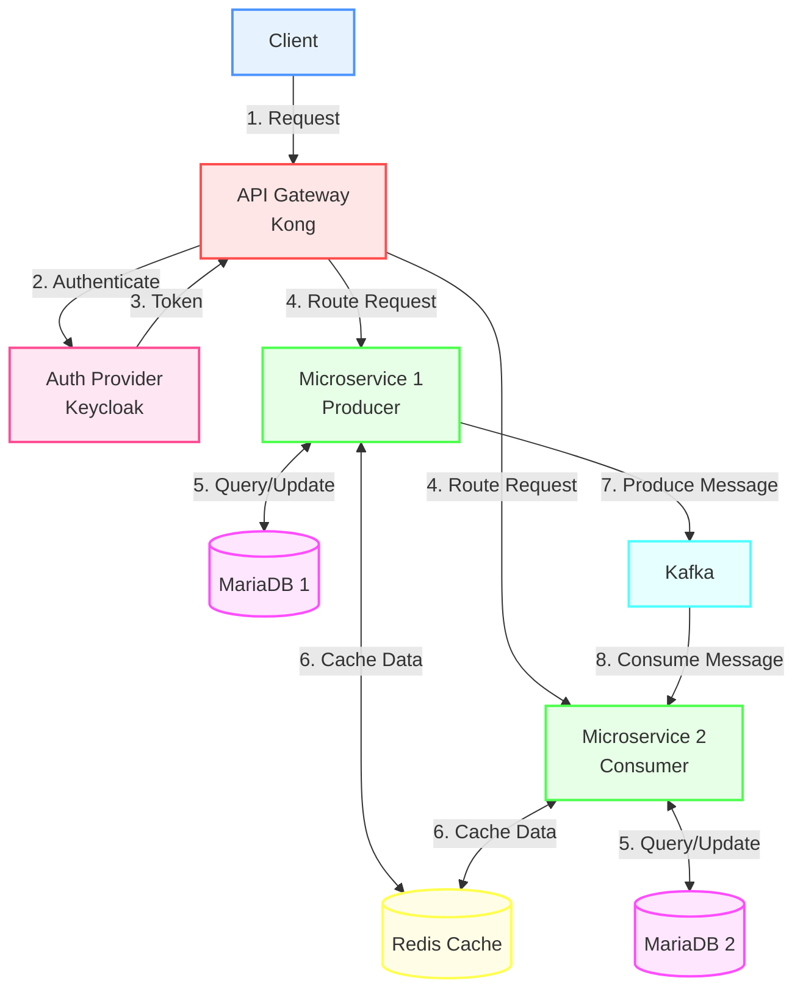

# Systems concept

## SaaS abstract design

### Prompt

I want to create a saas concept. Collect all required components for a SaaS software stack with microservices. The stack will be deployed on kubernetes, but for the concept the platform will be ignored.
I have a backend with database (mariadb), redis as a cache and kafka. I need an api gateway like kong and an auth provider (oidc) like keycloak.
The system has no frontend. The backend consists of two microservices, they send messages over kafka, so one is consumer and the other producer. It also needs log aggregation and monitoring. Suggest missing components and possible software that implements it (opensource, on-premise).
Design the system in an abstract way.

## Core Components

1. Microservices:
    - Two backend microservices (Producer and Consumer)
    - Implemented using a language/framework of your choice (e.g., Java with Spring Boot, Python with Flask, or Node.js with Express)

2. Database:
    - MariaDB + MaxScale

3. Caching:
    - Redis for improved performance and reduced database load

4. Message Broker:
    - Apache Kafka for asynchronous communication between microservices

5. API Gateway:
    - Kong for routing, authentication, and rate limiting

6. Authentication:
    - Keycloak for OIDC (OpenID Connect) authentication

## Additional Components

7. Service Discovery:
    - Consul or etcd for service registration and discovery[1][3]

8. Configuration Management:
    - Spring Cloud Config or HashiCorp Vault for centralized configuration management[1]

9. Log Aggregation:
    - ELK Stack (Elasticsearch, Logstash, Kibana) or Graylog for centralized logging[4]

10. Monitoring and Alerting:
    - Prometheus for metrics collection and alerting
    - Grafana for visualization and dashboards[4]

11. Distributed Tracing:
    - Jaeger or Zipkin for tracking requests across microservices[3]

12. Circuit Breaker:
    - Hystrix or Resilience4j for improved fault tolerance[3]

13. API Documentation:
    - Kong + Swagger + OpenAPI for documenting your API endpoints

14. Container Registry:
    - Nexus Repository for storing and managing container images

## Abstract System Design

```
+----------------+     +----------------+
|   API Gateway  |     |  Auth Provider |
|     (Kong)     |     |   (Keycloak)   |
+----------------+     +----------------+
        |                      |
        v                      v
+----------------+     +----------------+
| Microservice 1 |<--->| Microservice 2 |
|   (Producer)   |     |   (Consumer)   |
+----------------+     +----------------+
    |        |             |        |
    v        v             v        v
+------+ +-------+     +------+ +-------+
| Redis| |MariaDB|     |Kafka | |MariaDB|
+------+ +-------+     +------+ +-------+

+------------------+   +------------------+
| Log Aggregation  |   |   Monitoring     |
|   (ELK Stack)    |   |   (Prometheus/   |
|                  |   |    Grafana)      |
+------------------+   +------------------+

+------------------+   +------------------+
|Service Discovery |   |   Config Mgmt    |
|    (Consul)      |   | (Spring Cloud    |
|                  |   |    Config)       |
+------------------+   +------------------+

+------------------+   +------------------+
|     Tracing      |   | Circuit Breaker  |
|    (Jaeger)      |   |   (Hystrix)      |
+------------------+   +------------------+
```

This abstract design incorporates all the required components for a SaaS software stack with microservices. The system is designed to be scalable, maintainable, and resilient[2]. Each component is independent and can be deployed and scaled separately, adhering to microservices principles[1][3].

The API Gateway (Kong) serves as the entry point, routing requests to the appropriate microservices and handling authentication with Keycloak[1]. The two microservices communicate asynchronously through Kafka, with one acting as a producer and the other as a consumer[5].

MariaDB provides persistent storage for each microservice, while Redis is used for caching to improve performance[1]. The additional components such as service discovery, configuration management, log aggregation, and monitoring ensure the system's reliability, observability, and ease of management[3][4].

This design provides a solid foundation for your SaaS concept, allowing for future expansion and easy integration of additional microservices as your application grows.

Citations:
[1] https://www.mega.com/blog/what-is-microservices-architecture
[2] https://about.gitlab.com/topics/microservices/
[3] https://microservices.io/patterns/microservices.html
[4] https://www.aalpha.net/blog/saas-architecture/
[5] https://wesoftyou.com/outsourcing/best-practices-for-saas-development/
[6] https://www.peerbits.com/blog/microservices-architecture-for-saas-based-product-development.html
[7] https://cloudnativenow.com/topics/cloudnativedevelopment/application-dev/microservices-architecture-for-your-saas-app/
[8] https://www.allcloud.in/blog/the-role-of-microservices-in-saas-architecture-a-deep-dive


## Component Diagram

### Prompt

Now create a component diagram that also shows the communication flow between the components. The Api-Gateway is the entry point where all communication starts. Use a diagram framework that can generate visualizations from text. Use colors to support the diagram design.

### Excalidraw



### Mermaid diagram



This component diagram illustrates the communication flow between the various components of your microservices architecture:

1. The Client initiates a request to the API Gateway (Kong).
2. The API Gateway authenticates the request with the Auth Provider (Keycloak).
3. Upon successful authentication, Keycloak returns a token to the API Gateway.
4. The API Gateway routes the request to the appropriate microservice (either Microservice 1 or Microservice 2).
5. Microservices interact with their respective MariaDB databases for data persistence.
6. Both microservices can use Redis for caching to improve performance.
7. Microservice 1 (Producer) produces messages to Kafka.
8. Microservice 2 (Consumer) consumes messages from Kafka.

The diagram uses color-coding to distinguish between different types of components:
- External components (Client) are in light blue
- API Gateway is in light red
- Microservices are in light green
- Databases are in light purple
- Cache (Redis) is in light yellow
- Messaging (Kafka) is in light cyan
- Auth Provider is in light pink

This visual representation clearly shows the central role of the API Gateway as the entry point for all communication, and how the various components interact within the microservices architecture[1][4][8].

Citations:
[1] https://online.visual-paradigm.com/diagrams/features/component-diagram-software
[2] https://stackoverflow.com/questions/53545963/internal-communication-microservices-through-api-gateway
[3] https://online.visual-paradigm.com/diagrams/solutions/free-component-diagram-tool/
[4] https://sudoconsultants.com/exploring-the-power-of-api-gateway-a-single-entry-point-for-web-applications-and-api-microservices/
[5] https://www.lucidchart.com/pages/uml-component-diagram
[6] https://api7.ai/blog/api-gateways-in-microservices-architecture
[7] https://www.drawio.com/blog/uml-component-diagrams
[8] https://learn.microsoft.com/en-us/azure/architecture/microservices/design/gateway
[9] https://support.microsoft.com/en-us/office/create-a-uml-component-diagram-aa924ecb-e4d2-4172-976e-a78fa157b074
[10] https://aws.amazon.com/blogs/architecture/using-api-gateway-as-a-single-entry-point-for-web-applications-and-api-microservices/

